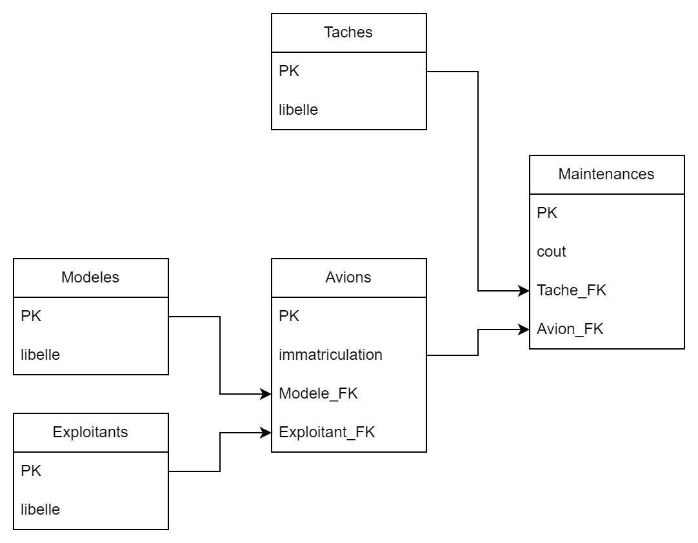

# Gestion de données

Application de gestion de données. Permet de gérer des données dans une base de données SQLite.
Le front-end est réalisé en React + TypeScript et le back-end en NodeJS/Express.
La partie interface est entièrement modulaire, aucune valeur, donnée, nom de table etc... n'est codé en dur,
pour ajouter une colonne par exemple, seuelement la base de données et l'API doivent être modifiées.

## Fonctionnalités

- Ajout, modification et suppression des entrées
- Ajout, modification et suppression des références
- Tri des colonnes
- Filtre text input choix 'contient' ou 'commence par'
- Support du filtre sur des valeurs numériques (\> < \>= <= =)

## Schéma de la base de données

La base de données utilisée est dans `maintenance.sqlite`,

`maintenance_default.sqlite` est la version par défaut telle qu'elle donnée dans le moodle (une fois le `.xls` converti en `.csv` dans Excel puis en `.sqlite` grâce aux scripts dans `./scripts/csv_to_db.py`).

Le schéma de la base de données est le suivant:



le script de création de la base de données est le suivant:

```sql
CREATE TABLE Exploitants (id INTEGER PRIMARY KEY AUTOINCREMENT, libelle VARCHAR(32) NOT NULL);
CREATE TABLE Modeles (id INTEGER PRIMARY KEY AUTOINCREMENT, libelle VARCHAR(32) NOT NULL);
CREATE TABLE Taches (id INTEGER PRIMARY KEY AUTOINCREMENT, libelle VARCHAR(32) NOT NULL);

CREATE TABLE Avions (
    id INTEGER PRIMARY KEY AUTOINCREMENT,
    imatriculation VARCHAR(16) NOT NULL,
    Modele_FK INTEGER NOT NULL,
    Exploitant_FK INTEGER NOT NULL,
    FOREIGN KEY (Modele_FK) REFERENCES Modeles(id)
    FOREIGN KEY (Exploitant_FK) REFERENCES Exploitants(id)
);

CREATE TABLE Maintenances (
    id INTEGER PRIMARY KEY AUTOINCREMENT,
    cout NUMERIC NOT NULL,
    Avion_FK INTEGER NOT NULL,
    Tache_FK INTEGER NOT NULL,
    FOREIGN KEY (Avion_FK) REFERENCES Avions(id),
    FOREIGN KEY (Tache_FK) REFERENCES Taches(id)
);
```

## Interface

L'interface et l'API sont faites sur JavaScript/TypeScript, React et NodeJS/Express respectivement.

## Installation

### Prérequis

- NodeJS
- npm
- SQLite

### Installation

1. Cloner le dépôt
2. Installer les dépendances du front-end et du back-end
3. Lancer le serveur

```bash
git clone
cd gestion-donnees
npm install
npm run dev
```

### Variables d'environnement

La configuration de l'application se fait via des variables d'environnement.
Créer un fichier `.env` à la racine du projet et ajouter les variables suivantes:

```bash
PASSWORD="MY_PASSWORD"
JWT_SECRET="MY_SECRET"
TOKEN_LIFETIME=3600000
HTTPS=false
```


